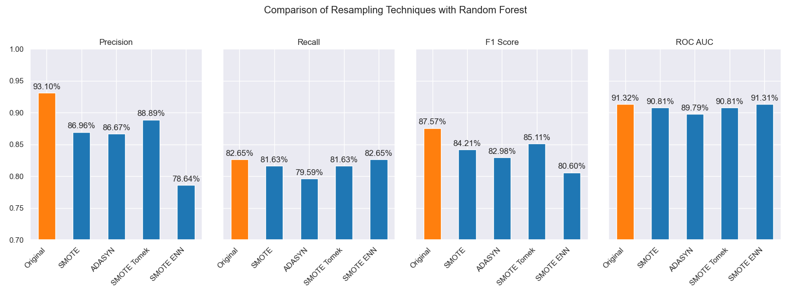

# Credit Card Fraud Detection with Resampling Techniques

---

## Introduction

The purpose of this project is to enhance my understanding of interpreting the results of machine learning models and evaluating various performance metrics, including confusion matrices, accuracy, precision, recall, F1 score, and ROC AUC. Additionally, I aim to gain insights into the importance and application of data resampling techniques. By exploring different resampling methods and their impacts on a well-known credit card fraud detection dataset from Kaggle, I hope to deepen my knowledge of when and why resampling might be beneficial.

This project also offers a practical guide for anyone interested in learning about the effects of data resampling on Logistic Regression and Random Forest model performance.

## Dataset

The dataset used in this project contains transactions made by credit cards in September 2013 by European cardholders. It presents transactions that occurred in two days, with 492 frauds out of 284,807 transactions. The dataset is highly imbalanced, with the positive class (frauds) accounting for 0.172% of all transactions.

You can find the dataset on Kaggle: [Credit Card Fraud Detection Dataset](https://www.kaggle.com/datasets/mlg-ulb/creditcardfraud)

---

## Resampling Techniques Implemented

### Overview

Resampling techniques are used to address class imbalance in datasets, a common problem in machine learning where one class significantly outnumbers the other. This imbalance can lead to biased models that perform poorly on the minority class. To mitigate this, various resampling techniques can be applied to balance the class distribution.

### Techniques

#### SMOTE (Synthetic Minority Over-sampling Technique)

**What it is:**  
SMOTE is an over-sampling technique that generates synthetic samples for the minority class. Instead of simply duplicating existing minority samples, SMOTE creates new samples by interpolating between existing ones.

**Why and When to Use:**  
SMOTE is used when the dataset is imbalanced, and the goal is to create a more balanced class distribution. It is particularly useful when the number of samples in the minority class is too low for effective training. By generating synthetic samples, SMOTE helps improve the model's ability to learn patterns related to the minority class.

#### ADASYN (Adaptive Synthetic Sampling)

**What it is:**  
ADASYN is an extension of SMOTE that focuses on generating synthetic samples for minority class examples that are harder to learn. It adapts the number of synthetic samples based on the learning difficulty, aiming to reduce the bias introduced by class imbalance.

**Why and When to Use:**  
ADASYN is used when there is a need to not only balance the class distribution but also to focus on the harder-to-learn examples within the minority class. This technique is beneficial when the minority class has complex patterns that the model struggles to learn.

#### Hybrid Approaches

**SMOTE + Tomek Links**

**What it is:**  
This hybrid approach combines SMOTE with Tomek Links, a data cleaning method that removes overlapping samples from different classes. After applying SMOTE to generate synthetic samples, Tomek Links identifies and removes pairs of samples from different classes that are closest to each other, effectively cleaning the dataset.

**Why and When to Use:**  
SMOTE + Tomek Links is used when there is a need to not only generate synthetic samples but also to clean the dataset by removing borderline samples that could cause confusion during training. This approach is useful for improving the model's precision.

**SMOTE + ENN (Edited Nearest Neighbors)**

**What it is:**  
This hybrid approach combines SMOTE with ENN, a method that removes samples from the majority class that are misclassified by their nearest neighbors. After applying SMOTE, ENN cleans the dataset by removing noisy and potentially confusing samples.

**Why and When to Use:**  
SMOTE + ENN is used when the goal is to generate synthetic samples and simultaneously clean the dataset of noisy majority class samples. This approach helps in improving the overall quality of the training data, leading to better model performance.

---

## Conclusion // Findings

After testing various resampling techniques with both logistic regression and random forest models, it is clear that random forest consistently outperforms logistic regression in the task of credit card fraud detection. This conclusion is drawn from the analysis of performance metrics such as accuracy, precision, recall, F1 score, and ROC AUC across different resampling methods.

## Performance Metrics

### 1. **Original Imbalanced Data**

    

        <ul>
            <li><strong>Accuracy:</strong> 0.9995962220427653</li>
            <li><strong>Precision:</strong> 0.9310344827586207</li>
            <li><strong>Recall:</strong> 0.826530612244898</li>
            <li><strong>F1 Score:</strong> 0.8756756756756757</li>
            <li><strong>ROC AUC:</strong> 0.9132125486660618</li>
        </ul>
    

    

        
    

### 2. **SMOTE**

    

        <ul>
            <li><strong>Accuracy:</strong> 0.9994733330992591</li>
            <li><strong>Precision:</strong> 0.8695652173913043</li>
            <li><strong>Recall:</strong> 0.8163265306122449</li>
            <li><strong>F1 Score:</strong> 0.8421052631578948</li>
            <li><strong>ROC AUC:</strong> 0.9080577503933481</li>
        </ul>
    

    

        
    

### 3. **ADASYN**

    

        <ul>
            <li><strong>Accuracy:</strong> 0.9994382219725431</li>
            <li><strong>Precision:</strong> 0.8666666666666667</li>
            <li><strong>Recall:</strong> 0.7959183673469388</li>
            <li><strong>F1 Score:</strong> 0.8297872340425533</li>
            <li><strong>ROC AUC:</strong> 0.8978536687606951</li>
        </ul>
    

    

        
    

### 4. **SMOTE Tomek**

    

        <ul>
            <li><strong>Accuracy:</strong> 0.9995084442259752</li>
            <li><strong>Precision:</strong> 0.8888888888888888</li>
            <li><strong>Recall:</strong> 0.8163265306122449</li>
            <li><strong>F1 Score:</strong> 0.851063829787234</li>
            <li><strong>ROC AUC:</strong> 0.9080753362121439</li>
        </ul>
    

    

        
    

### 5. **SMOTE ENN**

    

        <ul>
            <li><strong>Accuracy:</strong> 0.9993153330290369</li>
            <li><strong>Precision:</strong> 0.7864077669902912</li>
            <li><strong>Recall:</strong> 0.826530612244898</li>
            <li><strong>F1 Score:</strong> 0.8059701492537313</li>
            <li><strong>ROC AUC:</strong> 0.9130718621156959</li>
        </ul>
    

    

        
    

## Conclusion

### Key Findings

Through this project, I have explored the performance of logistic regression and random forest models on a well-known credit card fraud detection dataset from Kaggle. The results indicated that the random forest model consistently outperformed logistic regression in detecting fraudulent transactions. This aligns with the expectation that ensemble methods like random forest, which combine multiple decision trees, are more robust and better at capturing complex patterns in the data.

Surprisingly, the original imbalanced dataset outperformed all the resampled datasets across all performance metrics, including precision, recall, F1 score, and ROC AUC. This outcome suggests that, for this specific dataset and model combination, the random forest's inherent ability to handle class imbalance might be sufficient, and resampling did not provide additional benefits.

### Challenges and Learning

While I aimed to use functions and loops to streamline the creation of this project, I encountered significant performance issues. This experience highlighted the need for efficient coding practices, especially when working with large datasets and computationally intensive processes. In future work, I would explore parallel processing and optimized data handling techniques to improve performance and scalability. Researching libraries such as `joblib` for parallel processing or leveraging cloud-based solutions could offer substantial performance gains.

### Future Work and Next Steps

**Exploring Other Machine Learning Models for further exploration:**
   - **Gradient Boosting Machines (GBM):** GBM can often provide better performance than random forests by focusing on reducing the errors of previous models in an iterative manner.
   - **XGBoost:** This is an optimized version of gradient boosting and is known for its high performance and efficiency.
   - **Support Vector Machines (SVM):** SVMs can be effective in high-dimensional spaces and might perform well on this dataset.
   - **Neural Networks:** Deep learning models can capture more complex patterns and interactions in the data, potentially improving fraud detection rates.

### Final Thoughts

This project has provided valuable insights into the performance of different machine learning models and resampling techniques for fraud detection. While the original dataset's performance was unexpectedly superior, the process of exploring resampling methods has deepened my understanding of their potential benefits and limitations. Future work will focus on optimizing the code for performance, exploring more advanced models, and improving the robustness and scalability of the solution.
